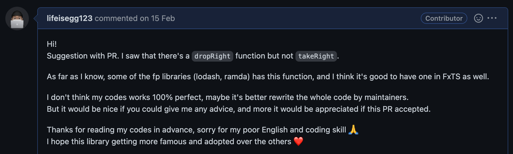
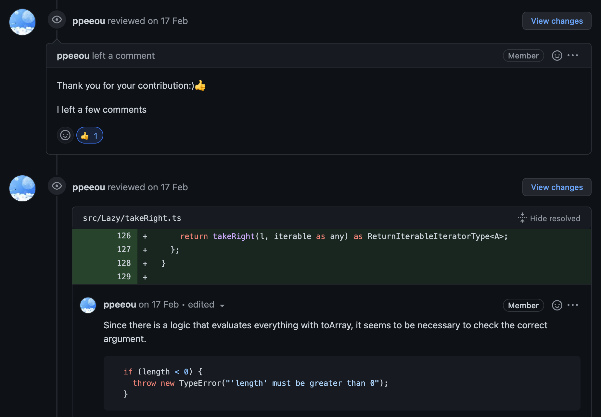
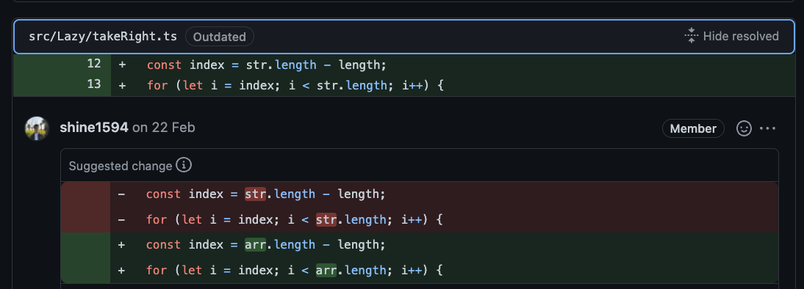
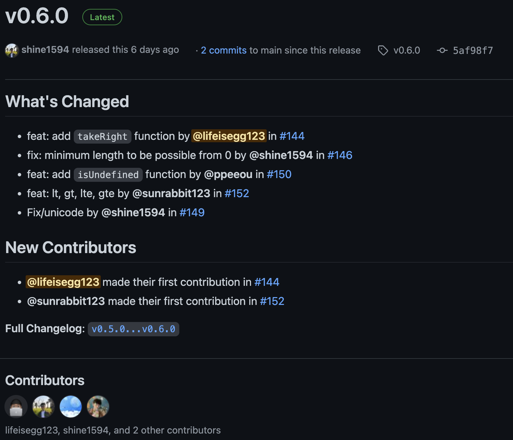

개발자로써 '한번쯤은 오픈소스에 기여해보고 싶다'라는 생각을 가지고 있지만, 예전의(어쩌면 지금도..?) 저처럼 어디서 부터 시작해야 할 지 막막한 분들을 위해, 오픈소스에 기여하게 된 계기와 그 과정에 대한 경험을 적어보려고 합니다.

> 아직 주니어 개발자이고 부족한 부분이 많기 때문에 이 점 감안하고 봐주시면 감사하겠습니다.
<!--truncate-->

## 오픈소스 해보고 싶다...
서두에 서술했듯 오픈소스에 기여해보고 싶다는 생각은 가지고 있었지만, 어떻게 기여하는 것인지도 잘 모르겠고 관심있는 라이브러리의 코드를 봐도 ‘검은건 글씨고 흰건 배경이다’ 수준으로 밖에 읽지 못하는 저의 실력에 좌절하며 금방 포기하곤 했었습니다.

### FxTS?
함수형 프로그래밍에 관심을 갖고 유인동님의 강의를 보던 중, [FxJS](https://github.com/marpple/FxJS) 라는 라이브러리에 관심을 갖게 되었고 조금 더 최근에 개발되고 있는 [FxTS](https://github.com/marpple/FxTS)라는 라이브러리가 있다는 것을 알게 되었습니다.

typescript로 작성된 함수형 유틸 라이브러리이고 FxJS보다는 제공중인 함수가 적었습니다. 강의를 보며 typescript로 진행되지 않는게 내심 아쉬었는데 이 라이브러리를 참고해가면서 공부하면 좋을 것 같다고 생각하여, 코드를 보게 되었습니다.

### 계기와 결심
코드를 구경하던 중 `drop`과 `dropRight`는 있는데 `take`는 있고 `takeRight`는 없다는 사실을 알게 되었고, 다른 라이브러리에는 이러한 함수가 있는지 확인해보았습니다.

lodash나 ramda와 같은 라이브러리에서는 `takeRight`라는 함수를 제공하고 있는 것을 확인했고, FxTS에도 있으면 좋을 것 같다고 생각하여, 직접 개발해서 PR을 올려보자라는 결심을 하게 되었습니다.

## 오픈소스 기여 과정
아직 함수형 프로그래밍에 대해 공부하던 수준인 저에게는 함수 하나를 짜는 일도 쉽지는 않았는데, FxTS에 작성된 다른 함수들과 타 라이브러리에 구현되어 있는 `takeRight`의 코드를 참고해가며 코드를 작성하기 시작했습니다.

### PR 작성
코드의 기능을 구현하고, 테스트코드와 간단한 문서를 작성하여 ‘코드가 반영되지는 못하겠지만 이런 시도를 해봤다는 것에 의의를 두자' 라는 심정으로 아래와 같은 PR을 올렸습니다. [(PR 링크)](https://github.com/marpple/FxTS/pull/144)


### 리뷰
PR을 올리고 며칠뒤 아래와 같은 메인테이너의 리뷰가 달렸고, 몇가지 수정사항에 대한 피드백을 받았습니다.


 

> 더 자세한 내용은 [PR 링크](https://github.com/marpple/FxTS/pull/144)에서 확인해보세요!

### 최종 코드
피드백 받은 사항들을 수정하였고, 다시 리뷰과정을 거쳐 최종적으로 머지가 되었습니다. 제가 구현한 `takeRight` 함수는 다음과 같습니다.

```ts
import { isAsyncIterable, isIterable } from "../_internal/utils";
import ReturnIterableIteratorType from "../types/ReturnIterableIteratorType";
import IterableInfer from "../types/IterableInfer";
import toArray from "../toArray";
import isArray from "../isArray";
import isString from "../isString";
import concurrent from "./concurrent";
import { isConcurrent } from "./concurrent";

function* stringTakeRight(length: number, str: string) {
  const arr = Array.from(str);
  const index = arr.length - length;
  for (let i = index; i < arr.length; i++) {
    if (arr[i]) yield arr[i];
  }
}

function* arrayTakeRight<A>(length: number, arr: Array<A>) {
  const index = arr.length - length;
  for (let i = index; i < arr.length; i++) {
    if (arr[i]) yield arr[i];
  }
}

function* sync<A>(length: number, iterable: Iterable<A>): IterableIterator<A> {
  const arr = toArray(iterable);
  const index = arr.length - length;
  for (let i = index; i < arr.length; i++) {
    if (arr[i]) yield arr[i];
  }
}

async function* asyncSequential<T>(length: number, iterable: AsyncIterable<T>) {
  const arr = await toArray(iterable);
  const index = arr.length - length;
  for (let i = index; i < arr.length; i++) {
    if (arr[i]) {
      yield arr[i];
    }
  }
}

function async<A>(
  length: number,
  iterable: AsyncIterable<A>,
): AsyncIterableIterator<A> {
  let iterator: AsyncIterator<A>;
  return {
    [Symbol.asyncIterator]() {
      return this;
    },
    next(_concurrent: any) {
      if (iterator === undefined) {
        iterator = isConcurrent(_concurrent)
          ? asyncSequential(length, concurrent(_concurrent.length, iterable))
          : asyncSequential(length, iterable);
      }

      return iterator.next(_concurrent);
    },
  };
}

function takeRight<A>(
  l: number,
  iterable: Iterable<A>
): IterableIterator<A>;

function takeRight<A>(
  l: number,
  iterable: AsyncIterable<A>,
): AsyncIterableIterator<A>;

function takeRight<A extends Iterable<unknown> | AsyncIterable<unknown>>(
  l: number,
): (iterable: A) => ReturnIterableIteratorType<A>;

function takeRight<A extends Iterable<unknown> | AsyncIterable<unknown>>(
  l: number,
  iterable?: A,
):
  | IterableIterator<IterableInfer<A>>
  | AsyncIterableIterator<IterableInfer<A>>
  | ((iterable: A) => ReturnIterableIteratorType<A>) {
  if (l < 0) {
    throw new TypeError("'length' must be greater than 0");
  }

  if (iterable === undefined) {
    return (iterable: A) => {
      return takeRight(l, iterable as any) as ReturnIterableIteratorType<A>;
    };
  }

  if (isArray(iterable)) {
    return arrayTakeRight<A>(l, iterable) as any;
  }

  if (isString(iterable)) {
    return stringTakeRight(l, iterable) as any;
  }

  if (isIterable<IterableInfer<A>>(iterable)) {
    return sync(l, iterable);
  }

  if (isAsyncIterable<IterableInfer<A>>(iterable)) {
    return async(l, iterable);
  }

  throw new TypeError("'iterable' must be type of Iterable or AsyncIterable");
}

export default takeRight;
```

### PR 머지 이후
pr이 머지된 이후로는 언제쯤 버전이 올라가서 제가 짠 코드가 배포될 지 기다리는 나날의 연속이었는데요, 며칠전 아래와 같은 [릴리즈노트](https://github.com/marpple/FxTS/releases/tag/v0.6.0)와 함께 제가 짠 코드가 배포되었습니다.



해당 함수에 대한 문서는 [여기](https://fxts.dev/docs/takeRight)에서 확인해 보실 수 있습니다.

## 소감
처음으로 오픈소스에 PR을 올린 것이라 당연히 반영이 되지 않을 것이라고 생각했었지만, 친절하게 코드리뷰를 해주신 덕분에 반영이 될 수 있었던 것 같습니다.

아직까지 배울게 많다는 사실을 다시한번 깨닫게 되었습니다. 이전엔 사용해 본 적이 없었던 function overloading을 사용해보았고, js의 `이터레이션 프로토콜`에 대해서도 좀 더 깊게 공부하게 되었습니다.

개인적으로 생각해 본 오픈소스를 하게 되며 얻는 장점은 아래와 같습니다.
  1. 해당 언어에 대한 이해도 상승
  2. 메인테이너에게 코드에 대해 리뷰받을 수 있는 기회
  3. 다른사람의 코드를 보며 모르는 것들을 학습
  4. 오픈소스에 기여했다는 뿌듯함(?)

## 기여 이후 현재는?
FxTS에 기여하며 얻은 자신감을 바탕으로 부족한 영어실력이지만 [pnpm](https://pnpm.io/ko/)의 문서 번역에도 참여해보고 있고, Recoil에 문서 오타를 수정하는 [PR](https://github.com/facebookexperimental/Recoil/pull/1700)을 올렸었습니다.

최근에는 react-query를 조금 더 편하게 사용하기 위해 [react-query-toolkit](https://github.com/lifeisegg123/react-query-toolkit)이라는 라이브러리도 개발하고 있습니다.

오픈소스에 기여하기 위한 첫발을 내딛기가 두렵고 어려웠지만, 그 한번의 시도를 통해 얻은 자신감을 바탕으로 더 다양한 활동들을 할 수 있게 된 것 같습니다. 앞으로 더 많은 분들이 오픈소스에 기여하며 더욱 활발하고 재밌는 개발문화가 만들어져 가길 기대합니다.
